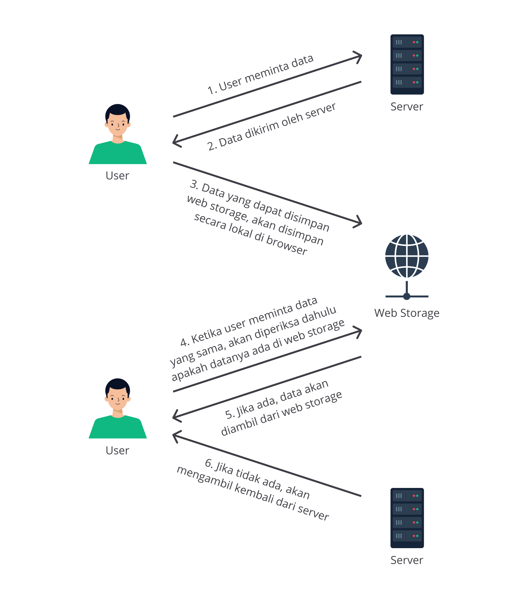

# Penyimpanan Data dengan Web Storage
Web Storage : Web API yang dapat simpan data secara lokal pada sisi client 
- data yang disimpan pada objek atau array JS bersifat sementara, akan hilang klo direload atau URL diganti 
- data yang disimpan pada web storage akan disimpan dlm storage browser-> tahan lama 
- data tersimpan berdasarkan domain (1 domain 10MB)
- 
- dengan web storage kita bisa pake data yang sudah pernah ada, gausah ngunduh berkali kali, apalagi utk preferensi di web kyk tema, warna dll 

## Macam-Macam Web Storage 
- data yang terimpan biasanya bertipe data primitif (number, boolean, string), namun bisa jg simpan data bentuk js object dengan ubah jd string (JSON) dulu
- key-value utk simpan dan akses data pd sorage 
- Data yang disimpan pada Web Storage dapat kita lihat menggunakan DevTools pada tabApplication (Google Chrome) atau tabStorage (Mozilla Firefox)

1. Local storage 
- menyimpan data tanpa ada batasan waktu
- Data yang disimpan tidak akan hilang bila browser atau tabs browser ditutup kecuali jika kita menghapusnya
- akses dengan objek `localStorage`
- simpan dengan method `setItem(key, value)` 
- akses dengan method `getItem(key)`
- dihapus dengan `removeItem(key)`

2. Session storage 
- menyimpan data sementara pada browser. 
- Data akan hilang ketika browser atau tab browser ditutup
- menggunakan global objek `sessionStorage`
- methodnya sama, `setItem(key, value)`, `getItem(key)`, `removeItem(key)`

