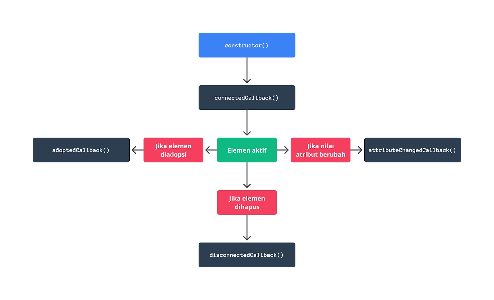
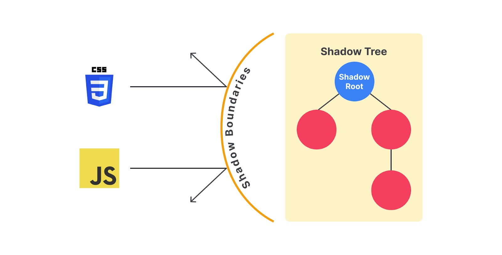

# Web Component
- reusable code -> function di bahasa pemrograman, tp di markup (HTML) gapunya function -> `Web Component`
- web component: standar HTML yg dibagung World WIde Web Consortium (W3C), akan membungkus kode spt function
- web component -> membuat custom element yang reusable-> custom komponen UI mudah dan jd lebih modular
- dapat digunakan pada framework apapun bahkan klo digabung sama library oembuat custom elemen jg no prob
- gaperlu konfigurasi khusus kyk framework yg ada 

Untuk menciptakan web component/custom element, ada 3 teknologi penting: 
1. Custom element - perlu JS API (Browser API) -> buat custom element dgn behaviour yang sesuai UI 
2. Shadow DOM - browser API utk bikin custom element terisolasi dan terpisah dr DOM utama -> seluruh script an style khusus tidak tabrakan dgn sisi lain -> DOM dan custom element bersifat private
3. HTML template - `template` `slot` -> untuk bikin templat struktur markup bagi sutom element, gaakan tampil di layar user

membuat custom element 
Latihan: bikin custom element baru yg nampilin gambar dan keterangannya 
1. buka folder image-figure 
2. bikin elemen baru pada direktori src 
3. bikin class ImageFigure 
4. masukin tag image-figure ke HTML 
5. import image-figure.js ke main.js

Define dan Render Custom Element 
2 hal wajib = bikin custom element dan sediakan template kontennya
bikin custom element murni dilakukan dgn manfaatin Browse API -> harus pake JS
custom element bikinnya pake clas dan harus warisin interface HTMLElement (seluruh eleen HTML merupakan turunan dr interface ini)
`class AwesomeComponent extends HTMLElement {}`

daftarkan dgn method `customElements.define` atau `window.customElements.define`. Properti customElements merupakan instansiasi dari interface CustomElementRegistry yang dapat diakses secara global.
`customElements.define('awesome-component', AwesomeComponent);`
2 parameter -> nama custom element dan class element

** aturan penamaan 
- dimulai dengan huruf kecil 
- pake tanda strip sebagai pemisah antar kata 
- gak mengandung huruf kapital 
- gak boleh pake nama seperti : 
"annotation-xml".
"color-profile".
"font-face".
"font-face-src".
"font-face-uri".
"font-face-format".
"font-face-name".
"missing-glyph".

## LifeCycle Web COmponent 
dimulai dari diciptakan, ditambahkan, dihilangkan ke DOM, dsb

daftar lifecycle callbacks pada HTMLElement: 
- constructor : inisialisasi awal pada reactive property
Ketika mengimplementasikan constructor, kita wajib memanggil method super()
```javaScript
class MyElement extends HTMLElement {
  constructor() {
    super();
    this.foo = 'foo';
    this.bar = 'bar';
    console.log('Constructor dipanggil');
  }
}

// Membuat instance dari elemen kustom
const myElement = new MyElement();
// Output: Constructor dipanggil

```
- connectedCallback : merupakan tempat yang tepat untuk menjalankan konfigurasi awal, seperti mengaktifkan shadow DOM, mendapatkan data, menerapkan event listener.
```javaScript 
class MyElement extends HTMLElement {
  connectedCallback() {
    const shadow = this.attachShadow({ mode: 'open' });
    window.addEventListener('keydown', () => { /* ... */ }); 
  }
}
```
- disconnectedCallback : tempat untuk membersihkan data yang masih disimpan pada elemen. Bisa itu event, state, ataupun objek. Ini bertujuan agar terhindar dari yang namanya garbage collector.
dijalankan ketika custom element dilepas dr DOM utama, biasanya pake `remove()`
```javaScript
class MyElement extends LitElement {
  connectedCallback() {
    window.addEventListener('keydown', () => { /* ... */ }); 
  }
 
  disconnectedCallback() {
    window.removeEventListener('keydown', () => { /* ... */ });
  }
}
```
- attributeChangedCallback : dijalankan ketika terjadi perubahan nilai atribut dari custom element. Callback ini bisa kita manfaatkan untuk memuat ulang data yang ditampilkan oleh elemen.
```javaScript
class MyComponent extends HTMLElement {
  /**
   * Kita bisa menetapkan lebih dari satu attribute yang diamati.
   * Caranya adalah memisahkan nama attribute menggunakan koma.
   * Contoh: return ['caption', 'title', 'src', .....]
   */
  static get observedAttributes() {
    return ['caption'];
  }
 
  attributeChangedCallback(name, oldValue, newValue) {
    console.log(`Attribute ${name} telah diubah.`);
  }
}
```
- adoptedCallback: dijalankan ketika custom element dipindahkan ke dalam dokumen baru. jarang dipake, kecuali dalam penggunaan spt <iframe>



### Handling Custom Attribute 
Custom attribute : atribut tambahan yang bisa ditambahkan ke custom element utk atur perilaku atau tampilan elemen tsb sehingga jd lebih dinamis 

- Penanganan attributes 
kita dapat akses dan gunakan nilai custom atribut dengan `getAttribute()`
- Deklarasi observed attributes 
deklarasikan atribut yang ingin dipantau perubahannya -> bikin custom element yang merespons perubahan nilai atribut tsb 
- Implementasi metode callback 
dengan metode callback kita bisa akses nilai atribut sebelum dan sesudah perubahan serta menerapkan logika perubahan yang diperlukan 

## Styling Custom Element 
Atribut yang diberikan pada custom element dapat digunakan sebagai input untuk styling. Dalam contoh yang diberikan, atribut color dan size digunakan untuk mengatur warna dan ukuran font dari custom element. 

Custom element harus mampu menanggapi perubahan dalam atribut yang diberikan -> pake metode attributeChangedCallback() digunakan untuk merespons perubahan atribut dan memperbarui styling secara otomatis.

Shadow DOM 
harus mempertimbangkan efek styling dari luar terhadap custom element, terutama ketika menggunakan eksternal stylesheet. Hal ini dapat mempengaruhi cara styling diterapkan pada custom element.
Shadow DOM memungkinkan pembuatan elemen yang terisolasi dari styling dan manipulasi eksternal.

Nested Custom Element 
kelola elemen kompleks dgn custom elemen -> memecah tampilan web jd agian bagian yg lebih kecil dan mudah dikelola 
 
## Shadow DOM 
Light DOM : DOM atau dokumen utama dalam sebuah halaman web, 
Shadow DOM : DOM tree yang memiliki shadow root. DOM tree dalam shadow DOM disebut dengan shadow tree. Bayangkan saja shadow root seperti elemen <html> yang berperan sebagai top-level element atau elemen akar.


- Efek Privat atau Encapsulation -> elemen-elemen dalam shadow tree terbebas dari efek style dan script yang ditambahkan dalam DOM utama. Ini memastikan bahwa komponen-komponen yang menggunakan Shadow DOM dapat terisolasi dan tidak terpengaruh oleh perubahan di luar.

beberapa terminologi penting: 
Shadow Host: elemen dalam DOM utama yang memiliki Shadow DOM terlampir. Dalam istilah sederhana, Shadow Host adalah tempat di mana Shadow DOM "menempel". Misalnya, jika kita memiliki elemen <my-component>, maka <my-component> adalah Shadow Host jika Shadow DOM digunakan di dalamnya.

Shadow Tree: Shadow Tree adalah struktur pohon DOM yang berada di dalam Shadow DOM. Ini adalah tempat di mana elemen-elemen yang terisolasi dari DOM utama ditempatkan. Shadow Tree berisi elemen-elemen, atribut, dan node lainnya yang berperan dalam menentukan tampilan dan perilaku Shadow DOM.

Shadow Boundary: Ini adalah batas atau perbatasan yang memisahkan Shadow DOM dari DOM utama. Ini menandai tempat di mana Shadow DOM dimulai dan berakhir. Di luar batas ini, elemen-elemen dari DOM utama tidak dapat memengaruhi atau berinteraksi dengan elemen-elemen dalam Shadow DOM.

Shadow Root: Ini adalah root atau akar dari Shadow Tree. Mirip dengan <html> dalam DOM utama, Shadow Root adalah titik awal dari struktur pohon DOM dalam Shadow DOM. Ini adalah tempat di mana elemen-elemen dalam Shadow Tree ditempatkan dan dimulai. Semua elemen dalam Shadow Tree terhubung ke Shadow Root.