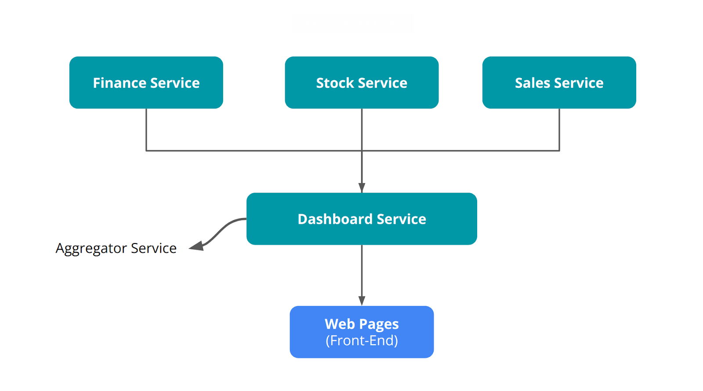

- Expressjs merupakan web framework tertua dan terpopuler di Node.js saat ini. Framework ini sangat ringan, mudah diintegrasikan dengan aplikasi web front-end, dan penulisan kodenya tidak jauh beda dengan Node.js native. 
- Framework Hapi menyediakan environment yang lengkap untuk mengembangkan web server yang kompleks. Bila menggunakan Hapi, kita tak perlu tools lain untuk menerapkan layer authentication, tokenize, cors, dan lain sebagainya. 
- bila Anda ingin membangun web server yang kompleks tanpa membutuhkan effort yang besar, Hapi adalah pilihan yang tepat.

- https://hapi.dev/tutorials/?lang=en_US dokumentasi hapi 

Dokumentasi pembelajaran Nia 
1. bikin folder 
2. npm init -> muncul package.json 
3. di package.json edit bagian scripts -> "start": "node server.js"
4. bikin file server.js
5. bikin HTTP server Hapi ga pake core modul http scr langsung -> pake modul pihak 3 `@hapi/hapi`
6. install dengan `npm install @hapi/hapi`
7. panggil hapi di script `const Hapi = require('@hapi/hapi)`
8. tulis dasar hapi 
```
// dasar kode dalam bikin HTTP server pada Hapi 
const init = async () => {
    const server = Hapi.server({
        port: 5000,
        host: 'localhost',
    });

    await server.start();
    console.log(`Server berjalan pada ${server.info.uri}`);
}

init();
```
9. jalanin server 
10. tambah routing biar bisa respons request sesuai dengan method dan url dari client pake `server.route()`
11. better berkas server.js dipisah dengan routingnya -> bikin `routes.js`


Cara Eslint 
1. npm install eslint@7.32.0 -> masih menyediakan untuk JSON 
2. npx eslint --init
How would you like to use ESLint? -> To check, find problems, and enforce code style.
What type of modules does your project use? -> CommonJS (require/exports).
Which framework did you use? -> None of these. 
Does your project use TypeScript? -> N.
Where does your code run? -> Node (pilih menggunakan spasi).
How would you like to define a style for your project? -> Use a popular style guide.
Which style guide do you want to follow? -> (Anda bebas memilih, sebagai contoh pilih AirBnB).
What format do you want your config file to be in? -> JSON.
Would you like to …… (seluruh pertanyaan selanjutnya) -> Y.
3. terbentuk berkas .eslintrc.json
4. di package.json tambahkan, 
"scripts": {
  "start": "nodemon server.js",
  "lint": "eslint ./"
},
5. npm run lint
6. npx eslint . --fix

Notes: 
request.params -> ambil id 
request.payload -> ambil data pada body request kyk title, tags, body dll
request.query -> ambil yang ?xxxx di url 

??
Readable Stream itu apa?
> Ketika menggunakan Node.js, untuk mendapatkan data pada body request--meskipun datanya hanya sebatas teks--kita harus berurusan dengan Readable Stream. Di mana untuk mendapatkan data melalui stream tak semudah seperti kita menginisialisasikan sebuah nilai pada variabel. 
> Di balik layar, Hapi secara default akan mengubah payload JSON menjadi objek JavaScript. Dengan begitu, Anda tak lagi berurusan dengan JSON.parse()
> Kapan pun client mengirimkan payload berupa JSON, payload tersebut dapat diakses pada route handler melalui properti request.payload

Response Toolkit 
Fungsi handler pada Hapi punya 2 parameter (request, h)
request : objek yang nampung detail dari permintaan client (path dan query parameter, payload, headers, dan sebagainya)
h : inisial Hapi : objek yang nampung banyak method utk nanggapi permintaan client 

Nanoid
> library untuk bikin string id yang unik 

Same Origin Policy -> Cross Origin Resource Sharing (CORS) agar bs interaksi
> server bisa nampung website, aplikasi, vid dll -> pas nyimpen biasanya data gambar, vid dll diambil dr alamat server lain 
> gak semua data bisa diambil dari origin yang beda 
> contohnya data JSON yang didapatkan melalui teknik XMLHTTPRequest atau fetch. Jika website meminta sesuatu menggunakan teknik tersebut dari luar origin-nya, maka permintaan tersebut akan ditolak. Itu disebabkan oleh kebijakan same-origin. Kasus ini terjadi pada aplikasi client dan web server yang kita buat.
> origin terdiri dari 3 hal : protokol, host, port
origin: http://notesapp-v1.dicodingacademy.com
protokol: http://
host: notesapp-v1.dicodingacademy.com
port: :80 (implisit)
> aplikasi client mengakses data dari origin yang sama, jika salah satunya beda maka permintaan akan ditolak 
> berikan nilai header Access-Control-Allow-Origin’ dengan nilai origin luar yang akan mengkonsumsi datanya (aplikasi client).

Error di CORS
> chrome://flags/#unsafely-treat-insecure-origin-as-secure

